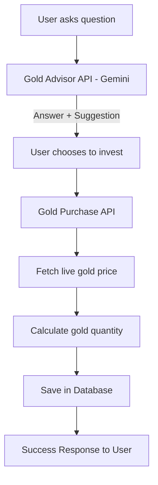
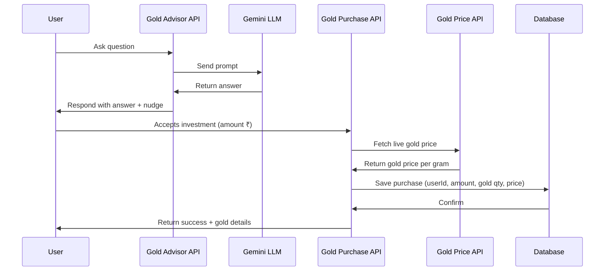

# 🪙 Gold Investment AI Workflow

## 📌 Overview

This project simulates the **Kuberi AI workflow for gold investments**.
It provides:

1. An AI-powered **Gold Advisor API** (using Google Gemini) that answers any question and nudges the user to invest in gold.
2. A **Digital Gold Purchase API** that lets users invest in digital gold (₹10 or more), fetches the **live gold price**, calculates the purchased gold in grams/milligrams, saves it in the database, and confirms the purchase.

---

## ⚙️ Tech Stack

- **Backend Framework:** Node.js + Express.js
- **AI Integration:** Google Gemini API (`@google/generative-ai`)
- **Gold Price Data:** [GoldAPI.io](https://www.goldapi.io/)
- **Database:** PostgreSQL
- **Deployment:** Render

---

## 🌐 Deployed App & Routes

The application is deployed and available at:

**Primary URL:** [https://gold-investment-ai-workflow-1.onrender.com](https://gold-investment-ai-workflow-1.onrender.com)

### Available Deployed API Endpoints

| Method | Endpoint             | Description                            |
| ------ | -------------------- | -------------------------------------- |
| `POST` | `/api/gold-advisor`  | Get AI-powered gold investment advice. |
| `POST` | `/api/gold-purchase` | Purchase digital gold.                 |

**Full URLs:**

- Gold Advisor: [https://gold-investment-ai-workflow-1.onrender.com/api/gold-advisor](https://gold-investment-ai-workflow-1.onrender.com/api/gold-advisor)
- Gold Purchase: [https://gold-investment-ai-workflow-1.onrender.com/api/gold-purchase](https://gold-investment-ai-workflow-1.onrender.com/api/gold-purchase)

---

## 🔗 API Endpoints

### 1️⃣ Gold Advisor API

**Endpoint:** `POST /api/gold-advisor`

- Takes a user question.
- Uses Gemini to generate an answer.
- If question is about gold → factual answer + nudge to invest.
- If question is not about gold → still answer, but add a gold investment suggestion.

**Request:**

```json
{
  "question": "What is inflation?"
}
```

**Response:**

```json
{
  "success": true,
  "answer": "Inflation is the rise in prices of goods and services over time. By the way, you can also protect your savings by investing in digital gold via our app. Would you like to try?"
}
```

---

### 2️⃣ Digital Gold Purchase API

**Endpoint:** `POST /api/gold-purchase`

- Lets users invest an amount (₹10 or more).
- Fetches **live gold price (per gram)**.
- Calculates purchased grams/milligrams.
- Saves purchase in database.

**Request:**

```json
{
  "userId": 1,
  "amount": 50
}
```

**Response:**

```json
{
  "success": true,
  "message": "You have successfully purchased digital gold worth ₹50!",
  "purchase": {
    "id": 102,
    "userId": 1,
    "amount": 50,
    "goldQuantity": "0.0083 g (8.3 mg)",
    "goldPricePerGram": 6012.23,
    "timestamp": "2025-08-26T18:30:00Z"
  }
}
```

---

## 🗄 Database Schema

### `users` table

| Column | Type    | Description |
| ------ | ------- | ----------- |
| id     | INTEGER | Primary Key |
| name   | TEXT    | User name   |
| email  | TEXT    | User email  |

### `gold_purchases` table

| Column          | Type     | Description                 |
| --------------- | -------- | --------------------------- |
| id              | INTEGER  | Primary Key                 |
| user_id         | INTEGER  | Foreign key → users.id      |
| amount          | DECIMAL  | Amount invested (₹)         |
| gold_quantity   | DECIMAL  | Gold bought (grams)         |
| gold_price_gram | DECIMAL  | Gold price at purchase time |
| timestamp       | DATETIME | Purchase time               |

---

## 📊 Workflow Diagrams

### 🔹 High-Level Flow



---

### 🔹 Sequence Diagram



---

## 🚀 Setup & Installation

1. **Clone repository**

   ```bash
   git clone https://github.com/your-username/gold-investment-ai.git
   cd gold-investment-ai
   ```

2. **Install dependencies**

   ```bash
   npm install
   ```

3. **Setup environment variables**
   Create `.env` file:

   ```
   GEMINI_API_KEY=your_google_gemini_api_key
   GOLD_API_KEY=your_goldapi_io_key
   GOLD_API_URL=https://www.goldapi.io/api/XAU/INR
   DATABASE_URL=./database.sqlite
   ```

4. **Run database migrations**

   ```bash
   npx prisma migrate dev --name init
   ```

5. **Start server**

   ```bash
   npm run dev
   ```

   Server runs at: `http://localhost:3002`

---

## 🧪 Testing APIs

### Test API 1 (Gold Advisor)

```bash
curl -X POST http://localhost:3002/api/gold-advisor \
  -H "Content-Type: application/json" \
  -d '{"question": "Is gold a good investment in 2025?"}'
```

### Test API 2 (Gold Purchase)

```bash
curl -X POST http://localhost:3002/api/gold-purchase \
  -H "Content-Type: application/json" \
  -d '{"userId": 1, "amount": 50}'
```
